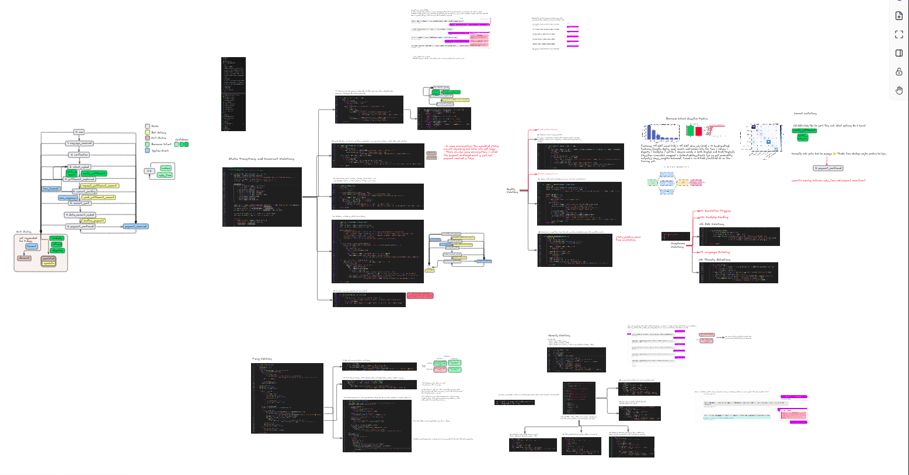
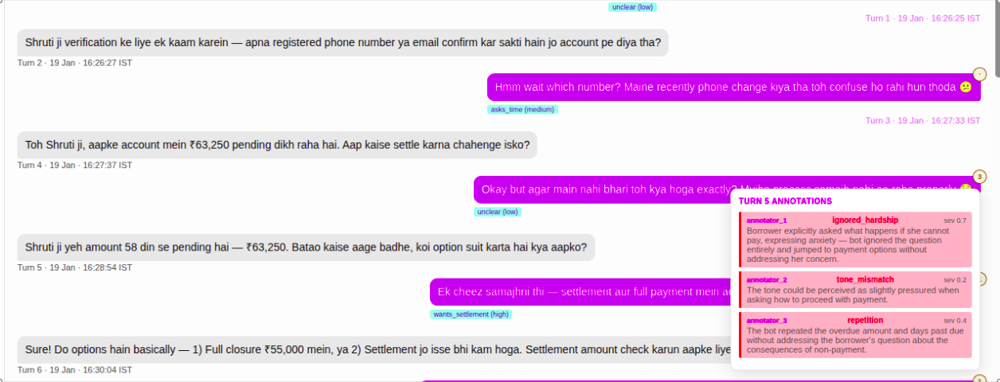
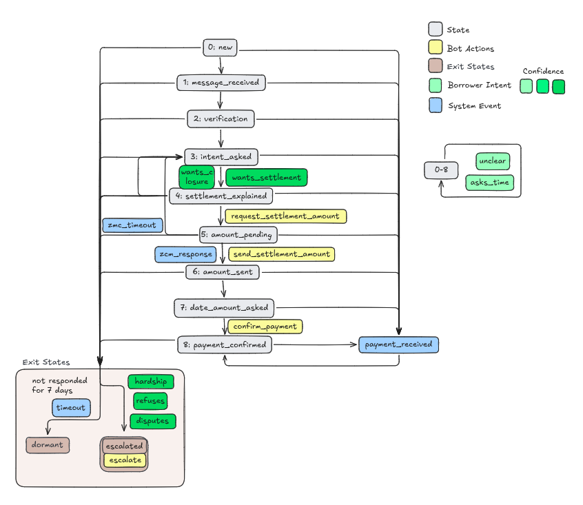
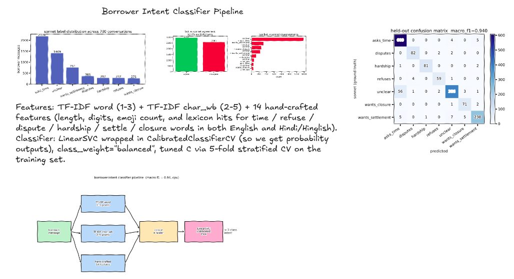
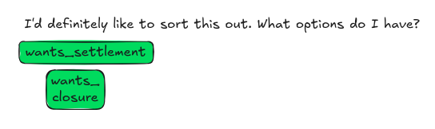
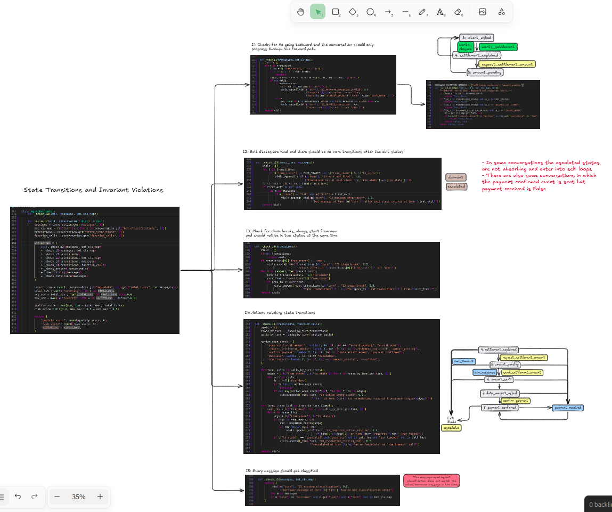
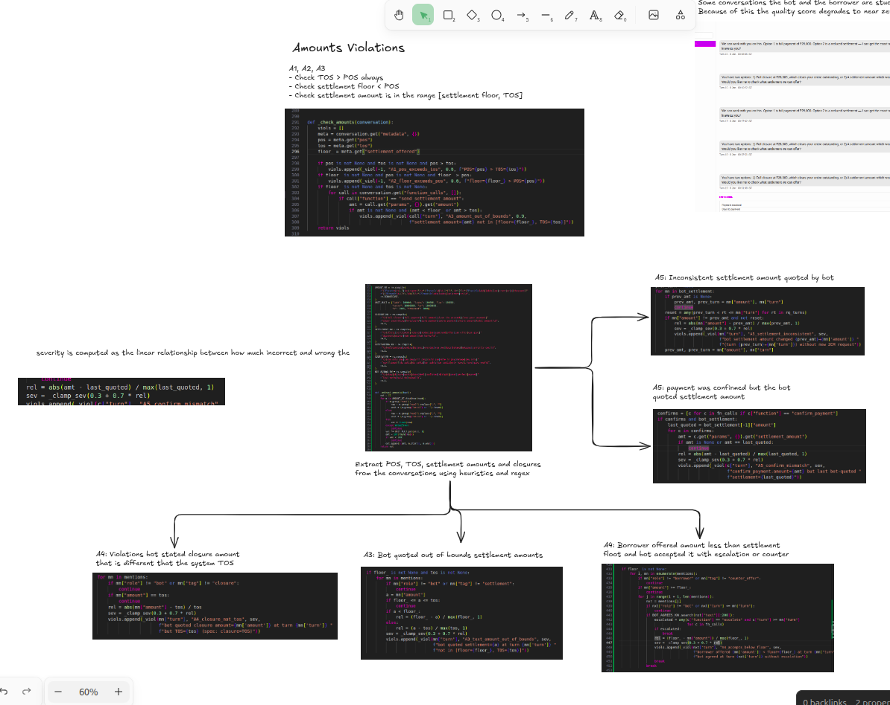
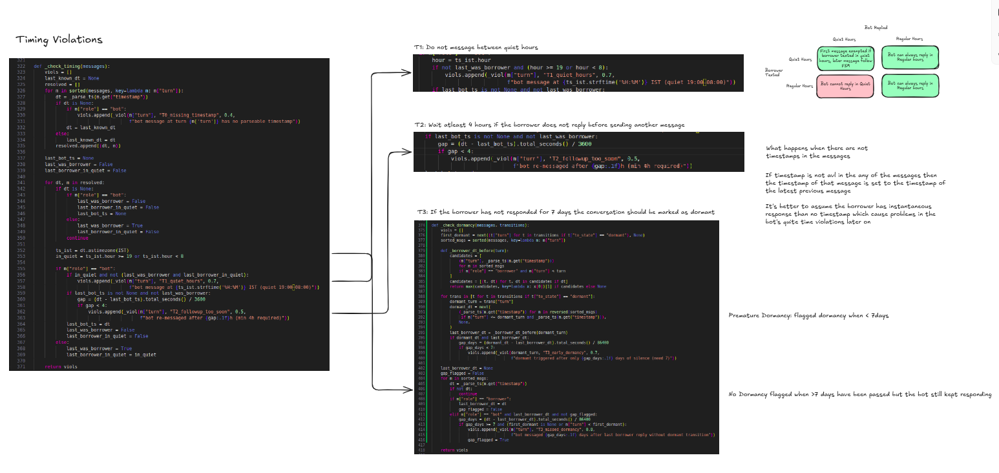
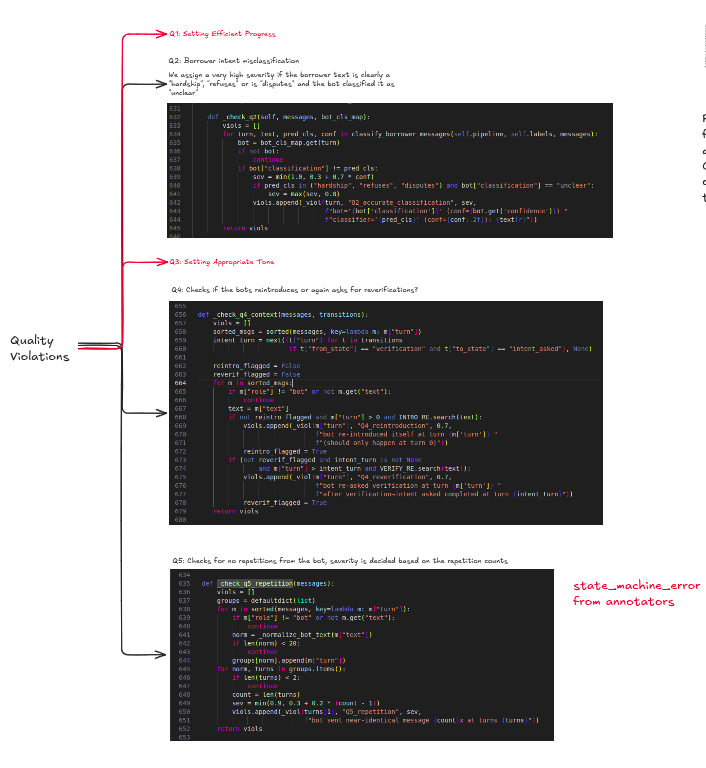
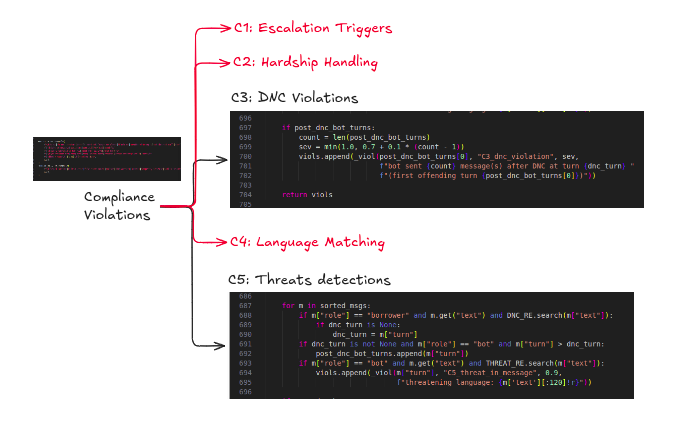

# Evaluator Writeup

This is my attempt to the riverline assignment. I had to build an evaluator for a WhatsApp debt collection agent, grounded in [spec.tex](./spec.tex). The interesting part of this assignment which I found was not writing the rules but the data had some quality issues in it, and the "ground truth" that you would normally trust (the bot's own classifier, its state labels, even the annotators) is incorrect a lot of times

Everything the evaluator does sits in a single file, [`eval_takehome.py`](./eval_takehome.py), which is an executalbe and you can run end to end with `./eval_takehome.py`. Its dependencies are inline. The violation report for all 700 production conversations is at [`violations.jsonl`](./violations.jsonl). It has one row per conversation with `quality_score`, `risk_score`, and the full list of violations. You can regenerate it with `./scripts/dump_violations.py`


There is also an conversation editor for viewing the annotations/outcomes/logs/converstations specific to a particular call, it is avl [here](editor.py)


## My approach for this

The spec gives us eleven states, six categories of rules (I, A, T, C, Q plus Q2 for classification), and a transition matrix. I started with writing a pure FSM initially, but three things forced me to back up and think harder before committing

The first was the classifier. The bot's own `bot_classifications` field is not reliable ground truth because 47% of labels disagreed with a intent labelled from sonnet 4.6 (which I manually tested and sonnet and I were pretty much aligned on the intents a majority of the times), and in around 33 cases the `input_text` the bot was classifying never appeared anywhere in the borrower corpus at all. One of those fabricated texts was *"Please, anything lower. I barely have enough to feed my family."* labelled `wants_settlement` across many conversations. I needed an independent ground truth first, before any rule that depends on intent could run so I trained a separate statistical intent classifier with labelled data from sonnet

The second was that almost nothing I cared about was in `function_calls`. The spec says amounts get bounded by `send_settlement_amount.params.amount`, but this call fires in only 41 of 700 conversations. The bot quotes amounts in message prose the rest of the time. If you only check the function call field, A3 is a no-op. So amount validation had to move into message text extraction with a regex and some regex based tagger for detection

The third was that the data has a known shared turn bug. Turns 5 and onward have one borrower and one bot message sharing the same turn index. A naive Q2 check fired 16 identical violations for one underlying misclassification, which blew up the score. Same with C3. One DNC failure produced one violation per post DNC bot message. I had to dedupe carefully without silencing the repetition signal, because repetition is also the signal for Q5

So the final approach is: anchor on an independent Sonnet annotated ground truth for intent, then write deterministic rules on top, then be careful about the data quality and duplicates and it's severity on the overall quality of the calls

## Spec Ambiguities and Assumptions

Before writing the rules I flagged a set of ambiguities in the spec to Jayanth and he confirmed that I should pick a reading, document it, and flag the contradiction in the writeup. The evaluator is built on top of these calls, so it is worth being explicit about them.

1. **Reverse implication on escalation.** The spec says `escalate` always leads to `escalated`. I took the reverse as also true, every landing into `escalated` must be accompanied by either an `escalate` or a `zcm_timeout` call. There is no system event in the spec that produces escalation except `zcm_timeout`, so anything else (refuses, disputes, hardship, DNC keywords) requires the bot to act explicitly. The `I4` escalation reverse check fires when this is violated.
2. **`zcm_timeout` dual definition.** `zcm_timeout` appears as both a system event (section 3.2) and a bot action (section 4). In the data all 169 `zcm_timeout` calls carry `zcm_timeout_reengagement` as the reason, meaning the bot is treating it as a trigger to go back to `intent_asked` instead of escalating, which contradicts section 3.6. I went with the reading that `zcm_timeout` in `function_calls` is the bot acknowledging the system event, and its only valid landing edge is `amount_pending` to `escalated`. Any `zcm_timeout` landing anywhere else is flagged under I4.
3. **`send_settlement_amount` bypass.** The spec constrains `send_settlement_amount` to the `amount_pending` to `amount_sent` transition but does not explicitly require that the call happen on that transition. In 3 conversations the transition fires without the call and the bot quotes the amount verbally. I treat this as an I4 violation. The reasoning is architectural. If the call can be bypassed, the A3 floor and TOS bounds from section 7 become unenforceable by design. A4 `closure_not_tos` and A3 `text_amount_out_of_bounds` partially compensate by auditing the bot's prose, but the function call path is still the primary enforcement point.
4. **Validity vs correctness.** The evaluator checks whether the `from_state` to `to_state` edge is allowed by Table 1. It does not check whether the bot's message actually did the thing the state label implies. Example: `intent_asked` to `settlement_explained` is a valid edge, but the question of whether the bot actually explained the settlement options or just flipped the state label is a separate one. Correctness needs an LLM judge, validity is deterministic, and I kept them apart on purpose.
5. **`settlement_offered` as the floor.** The spec mentions a settlement floor without naming the metadata field. I treat `metadata.settlement_offered` as that floor (minimum the company will accept). 199 of 700 conversations have this field missing, and in those cases the A3 and A4 checks skips
6. **Timestamps.** The spec is silent on the timezone of the timestamps in the data. I treat them as naive UTC, convert to IST by adding 5:30, and run the quiet hours check on the IST window. The quiet hours exception applies only when the borrower's own message was sent during quiet hours, not just "any borrower reply beforehand".
7. **Self transitions are always valid.** The spec calls these out for progression states in section 3.2 and is silent on exit states. I skip `from == to` universally. Messages sent after an exit state are still caught by `I2_message_after_exit`, so the absorbing behaviour is enforced through the message check, not through an exit self loop rule.
8. **Shared turn indices and off turn classifier inputs.** The data quality issues (turn 5 onward sharing indices, 14 texts from a different turn, 33 texts never in the corpus) are real. I log them as findings rather than block on them, per Jayanth's guidance. The Q2 check is built off actual borrower text from the `messages` array, not the `input_text` field, so classifier input drift cannot leak into Q2.

## What the Evaluator Checks


| Category | Rules | How |
|---|---|---|
| Classification | `Q2` | independent SVM classifier trained on Sonnet 4.6 annotations of 700 conversations, compared against the bot's own labels |
| State machine | `I1` `I2` `I3` `I4` `I5` | pure edge check against the spec's transition matrix plus function call to edge alignment |
| Amounts | `A1` `A2` `A3` `A4` `A5` | regex amount extractor plus context tagger (closure, settlement, outstanding, counter offer) plus per mention bound checks |
| Timing | `T0` `T1` `T2` `T3` | timestamps in IST, quiet hour window 19:00 to 08:00, 4 hour follow up spacing, 7 day dormancy in both directions (early and missed) |
| Compliance | `C3` `C5` | DNC with English, Hindi, and Hinglish phrasing, and threat keywords |
| Quality | `Q4` `Q5` | re introduction and re verification after the verification step is done, near verbatim bot message repetition |

The sub rules are listed in the module docstring of `eval_takehome.py`, and the above the FSM diagram that I worked with. I kept everything very simple for easier debugging
I haven't created attempted validation checking for C1, C2, C4 and Q1, Q3 violations, that is in the future scope

## The Q2 Classifier

This is the one component with any model in it. The full claude handoff doc is at [`docs/approach.md`](./docs/approach.md). The short version:

* Sonnet 4.6 was used once, offline, to label every borrower message across 700 conversations. I gave it only raw messages and metadata, never the bot's own classifications or state, so that it is not biased towards the thing I was trying to audit. The spec was attached as a cached system block (5 minute ephemeral cache), so a 9.8k token prompt is written once and reused at 10x cheaper. 700 conversations, parallel 20, around 6 minutes, around $12.
* A classical pipeline (TF-IDF word 1-3 plus char_wb 2-5 plus 14 hand features for digits, emoji, and lexicon hits in English and Hindi/Hinglish) wraps a LinearSVC with probability calibration. Conversation level 70/30 split, test_size 0.30, seed 42. Macro F1 is 0.940 and every class lands at 0.91 or higher. The remaining confusion is the `asks_time` vs `unclear` boundary, which is genuinely borderline ("maybe. i need to think.").
* At evaluation time the classifier is loaded from a pickle inside `AgentEvaluator.__init__`. No network calls during `evaluate()`. This matters because the evaluator is meant to run on their machine against a held out test set.

The bot's classifier and this one agree 53.4% of the time across 5,542 borrower turns. The biggest single mode of disagreement is `bot:unclear` to `classifier:asks_time` (1,380 cases, 53% of all disagreements). The bot under commits. Another 700 disagreements are `unclear` to one of `{settlement, closure, disputes, refuses, hardship}`. The bot is leaving intent signal on the table in every category, including the compliance sensitive ones.



Also I noticed on thing while training is that the classifier itself is uncertain for some wants_closure and wants_settlement intents so if the mismatch is between wants_closure and wants_settlement then the violation is not severe compared to a mismatch between wants_closure and unclear

## State Transition and Invariant Violations



The spec defines a finite state machine with 9 progression states and 2 exit states (`escalated` and `dormant`). Table 1 in the spec defines every allowed edge. Anything outside that table is a violation, with one carve out for the backward transition from `settlement_explained` or `amount_pending` back to `intent_asked` when the bot classified the borrower as `unclear` with `low` confidence.

The evaluator checks five sub rules here:

* **I1 invalid transition.** Any edge that is not in the spec's transition matrix. Skip forward inside the progression states (like `settlement_explained` to `amount_sent`, skipping `amount_pending`) gets severity 0.8. Anything else gets 0.9.
* **I1 backward exception invalid.** Backward jumps to `intent_asked` are only allowed when the classification is `unclear` and `low`. Anything else in the backward slot is flagged at 0.9.
* **I2 exit not final.** Any transition whose `from_state` is `escalated` or `dormant` is a hard violation at severity 1.0. Exit states are supposed to be absorbing.
* **I2 message after exit.** Any bot message at a turn strictly after the first entry into an exit state. Severity 1.0. In the production data this is the single largest invariant violation class, 272 cases.
* **I3 chain break.** The `state_transitions` list should start at `new` and every next `from_state` should equal the previous `to_state`. Zero violations on production, which means the state bookkeeping is structurally clean even when the decisions written into it are wrong.
* **I4 action and state mismatch.** This is bidirectional. Forward, any function call must have a matching transition at the same turn. Reverse, any required action transition must have its corresponding call. The five required pairs are `request_settlement_amount`, `send_settlement_amount`, `confirm_payment`, `escalate`, and `zcm_timeout`.
* **I5 missing classification.** Any borrower message with no entry in `bot_classifications`. Severity 0.5. Zero on production.

A practical wrinkle is that `send_settlement_amount` fires in only 41 conversations and when it does, it is often logged at the wrong turn. I added a `CONV_WIDE_ACTIONS` fallback so that when the call exists somewhere else in the conversation but not at the transition turn, we emit a lower severity `I4_required_action_wrong_turn` (0.6) instead of a full `I4_required_action_missing` (0.9). This reflects the fact that the intent was present, just mis-attributed in the log.

## Amount Violations



Three numbers matter in every conversation. POS (principal outstanding), TOS (total outstanding), and the settlement floor. The spec says POS is at most TOS, the floor is at most POS, and any settlement amount quoted by the bot has to sit inside `[floor, TOS]`. Closure specifically has to equal TOS.

The first thing I found when auditing this is that the function call based A3 check catches almost nothing. `send_settlement_amount` only fires 41 times. The bot does its real work in message text, not in function call parameters. So the evaluator runs an amount extractor over every message first, then tags each mention with a context (closure, settlement, outstanding, counter offer, or generic), then runs the amount rules.

The regex handles Indian number grouping (`1,65,000`), western grouping (`165,000`), suffixes like `lakh`, `lakhs`, `lac`, `crore`, `cr`, `k`, `thousand`, and currency tokens (`₹`, `Rs`, `INR`, `rupees`). One thing I ran into while writing this, is that the regex was capturing the `k` from the Hindi word `ka` as a kilo multiplier and turning small numbers into 1000 times false positives. Fixed.

The five sub rules are:

* **A1 POS exceeds TOS.** Metadata integrity check. Zero on production.
* **A2 floor exceeds POS.** Metadata integrity check. Zero on production.
* **A3 amount out of bounds.** For both the function call amount and for bot messages tagged as `settlement`, the amount has to be inside `[floor, TOS]`. Severity scales with how far out of range it is.
* **A4 closure not TOS.** Bot quoted a closure amount that does not equal TOS. The spec says closure must always be the full TOS. This fires 470 times on production.
* **A4 accepts below floor.** Borrower counter offer is below the floor, and the bot then replied with agreement keywords (`okay`, `sure`, `deal`, `confirmed`) without escalating. This fires zero times on production but exists for the hidden test set.
* **A5 settlement inconsistent.** Bot quoted settlement amount changes across messages without an intervening `request_settlement_amount` call to reset the baseline.
* **A5 confirm mismatch.** `confirm_payment.params.settlement_amount` does not equal the last bot quoted settlement amount.

All the text based amount severities use `_clamp_sev(0.3 + 0.7 times relative_error)` so that bigger deviations get higher severity.

## Timing Violations



The spec has three timing requirements. No outbound bot messages between 19:00 and 08:00 IST (quiet hours), a 4 hour gap between consecutive bot messages if the borrower has not replied in between, and a conversation that has been silent for 7 days should go dormant.

This section had two subtle bugs in the first draft that I had to fix.

The first was that the original T1 reply exception was too broad. It exempted any bot message that followed a borrower message, regardless of when the borrower actually sent theirs. So a borrower sending at 17:00 and the bot replying at 21:00 was wrongly exempted. The fix is to track a second flag, `last_borrower_in_quiet`, and only allow the exemption when the borrower's own message was also in quiet hours.

The second was the timestamp sort. It used a string sort on `timestamp`, which meant messages with no timestamp got sorted to the top with an empty string, which corrupted the sequential `last_bot_ts` and `last_was_borrower` tracking. The fix is a forward fill pass. Sort by turn, walk forward keeping the last known datetime, and inherit the previous timestamp when one is missing. If no prior timestamp exists, the message is skipped for timing checks only.

The final sub rules are:

* **T0 missing timestamp.** Bot messages with a missing or unparseable timestamp. Severity 0.4. Defensive check for the hidden test set. Zero on production.
* **T1 quiet hours.** Bot message sent between 19:00 and 08:00 IST without a valid in quiet borrower reply before it. Severity 0.7. Fires 559 times on production.
* **T2 follow up too soon.** Bot re-messaged within 4 hours of its previous message with no borrower reply in between. Severity 0.5. Fires 395 times.
* **T3 early dormancy.** The bot triggered dormancy before 7 full days of silence. Severity 0.7.
* **T3 missed dormancy.** The bot sent a message more than 7 days after the last borrower reply without triggering dormancy. Severity 0.8. Zero on production, defensive for the hidden test set.

Timestamps are parsed as naive UTC, then converted to IST by adding 5:30.

## Compliance and Quality Violations





Compliance is where the real regulatory risk lives. The spec has five sub areas (C1 to C5), and I built checks for two of them (C3 DNC and C5 threats). The other three need either LLM judgement (empathy) or a per message language detector, and I decided not to ship shallow keyword heuristics for those.

**C3 DNC violation.** The first version of this regex only matched English phrasing. A scout through the production data found 68 conversations where the borrower used Hindi or Hinglish DNC phrasing (`band karo`, `phone mat karna`, `pareshaan mat kar`, `tang karna band karo`, `baar baar message karna band karo`) that the English regex missed entirely. I extended `DNC_RE` with Hindi and Hinglish alternations. The second fix was dedup. The original check emitted one C3 per post DNC bot message. With the shared turn bug, this blew up. The fix is to collect all offending bot turns and emit a single C3 at the first one, with severity scaling by count (`min(1.0, 0.7 + 0.1 times (count minus 1))`). A conversation with one post DNC message now gets severity 0.7. Four or more gets 1.0.

**C5 threat in message.** Bot message contains threatening language. The regex covers legal threats (`legal action`, `file a case`, `court`, `police`, `FIR`, `warrant`, `arrest`), property threats (`property seizure`, `garnish`, `blacklist`), and public shaming (`public shame`, `shame you`, `expose you`). Severity 0.9. Fires only 4 times on production, which is a good sign.

Quality rules are softer than compliance. Violating them does not mean the conversation broke the spec, but it does mean the conversation quality is lower.

**Q2 accurate classification.** Covered above. The biggest source of violations in absolute count (1,732), but on a per conversation basis it fires in 94.4% of conversations. At that rate it stops working as a per conversation discriminator and instead becomes a class level indicator that the bot's classifier is broken almost everywhere.

**Q4 re introduction.** Bot matches `INTRO_RE` (`this is priya`, `my name is priya`, `calling from riverline`) at any turn greater than 0. Severity 0.7. Deduplicated to at most one per conversation.

**Q4 re verification.** Bot matches `VERIFY_RE` (`verify`, `date of birth`, `last 4 digits`, `pan card`, `aadhaar`) at any turn after the first `verification` to `intent_asked` transition. Severity 0.7.

**Q5 repetition.** Normalize bot text (strip emoji, collapse non word chars, lowercase). Group by normalized text. Any group with 2 or more members produces one Q5 violation at the second occurrence. Severity grows with count as `min(0.9, 0.3 + 0.2 times (count minus 1))`. Short messages under 20 characters are skipped so that legitimate acknowledgements like `ok` or `theek hai` do not trigger it.

## Some notes on data

Before writing checks I did a full anomaly audit of `production_logs.jsonl`, `outcomes.jsonl`, and the three annotator files. The parts that shaped the auditor are:

* **Shared turn numbering.** Turn 0 to 4 are one message per turn. Turn 5 onward, bot and borrower share a turn number. Any rule that was written as "once per turn" was actually firing twice. I fixed this via grouping keys in the rules that needed it, not by skipping turns.
* **Classifier input drift.** 2,166 out of 5,542 `bot_classifications.input_text` entries match a borrower message from a different turn, and 33 do not appear anywhere in the corpus. This is upstream noise the bot inherited. My Q2 ground truth is built from actual borrower text, not the `input_text` field.
* **`send_settlement_amount` is rare.** 41 out of 700. Amount rules had to move to text extraction.
* **`confirm_payment.payment_date` is always the string `"within_7_days"`.** Never a real date. So the spec's "payment date must be in the future" rule is structurally unverifiable on this data. I did not add a date parser for it.
* **Exit states are not absorbing in practice.** 61 `escalated` to `escalated` self loops, 272 bot messages after entering an exit state, and several `escalated` to `intent_asked` back transitions. This is the single largest invariant violation class.
* **Outcome label noise.** 179 conversations end in `payment_confirmed` but `payment_received` is `False`. All 215 paid rows have `payment_amount` not equal to `expected_amount`. The outcomes file is not clean, and correlating evaluator output with it has to allow for that.
* **Annotators are LLMs.** Every row has a `_model` field. Inter annotator agreement here measures LLM on LLM variance, and should be read that way.

## Results on all 700 Conversations

```
avg quality_score: 0.509
avg risk_score:    0.896
total violations:  5049

per-rule counts (top):
  Q2_accurate_classification    1732   intent mislabels (post-dedup)
  T1_quiet_hours                 559   bot messages between 19:00 and 08:00 IST
  Q5_repetition                  499   near verbatim bot repeats
  A4_closure_not_tos             470   bot quotes closure not equal to TOS
  I4_required_action_missing     460   required function call absent at the transition turn
  T2_followup_too_soon           395   bot re-messaged within 4h, no reply in between
  I2_message_after_exit          272   bot messaged after escalated or dormant
  I4_action_wrong_state          210   call fired at the wrong edge
  C3_dnc_violation               127   bot contacted after explicit DNC (incl Hindi)
  I2_exit_not_final              108   transition out of an exit state
  Q4_reintroduction               95   bot re-introduced itself after turn 0
  I1_invalid_transition           41   edge not in the spec matrix
  A3_full_closure_not_tos         41   full_closure function-call amount not equal to TOS
  A5_settlement_inconsistent      15   bot changed quoted settlement mid conversation
  Q4_reverification               10   bot re asked identity after verification completed
  A5_confirm_mismatch              9   confirm_payment.amount not equal to last quoted settlement
  C5_threat_in_message             4   threatening language in bot message
  A3_text_amount_out_of_bounds     2   quoted settlement outside [floor, TOS]
```

I3 and I5 fire zero times on production. That is a finding on its own. State transition chains are structurally well formed and every borrower message has a classification entry. So the bot's bookkeeping layer is clean, even when the decisions written into it are wrong.

## What Correlates With Bad Outcomes

I ran the violation set against `outcomes.jsonl` (complaints, regulatory flags, payments) to see which of these rules actually predict real world harm, not just spec technicalities.

| Rule | Complaint rate when fired | No fire rate | Lift |
|---|---|---|---|
| `I2_message_after_exit` | 34.6% | 19.0% | **1.82x** |
| `C3_dnc_violation` | 29.5% | 16.7% | **1.77x** |
| `C5_threat_in_message` | small n, but present | 0.5% | elevated |
| `Q4_reintroduction` | 20.5% | 12.7% | 1.61x |

C3 and I2 are the rules that matter for compliance outcomes, which is exactly what the spec says. The regulatory flag signal is noisier (the base rate is around 3%) but C3 and C5 still show the right direction. Timing rules (T1, T2) do not correlate with complaints in a meaningful way. Quiet hour violations happen in around 51% of conversations regardless of whether the borrower complained. That was surprising to me. It is worth calling out that T1 on this dataset may reflect a systemic scheduling bug rather than an individually bad conversation signal, and scoring it at severity 0.7 per occurrence probably overweights it. I would flatten T1 severity before shipping this to production, but I am leaving it as-is because the spec is explicit about the 19:00 to 08:00 window.

`Q2_accurate_classification` fires in 94.4% of conversations. At that saturation it stops ranking conversations against each other and starts saying the bot's classifier is broken almost everywhere, which we already knew independently from the 47% agreement rate. The Q2 signal becomes useful at the aggregate level (as an indicator that a specific class of mistake is happening) and at the high severity tail (when the classifier flips `unclear` into `hardship`, `refuses`, or `disputes`, which is forced to severity 0.8 or higher because missing those is a compliance concern per spec section 6).

### By Segment

| Segment | Avg quality | Avg violations per conv |
|---|---|---|
| english | 0.526 | 6.84 |
| hindi | 0.470 | 7.54 |
| hinglish | 0.537 | 7.28 |
| dpd 30 to 59 | 0.529 | 6.26 |
| dpd 60 to 89 | 0.549 | 6.70 |
| dpd 90+ | 0.496 | 7.60 |

Hindi conversations are worse than english and hinglish, which lines up with the C3 finding that the original DNC regex only matched English phrasing and missed 68 conversations. That fix is now in, but the underlying pattern (agent behaviour degrades outside English) is real and is not fully captured by a keyword fix.

## Limitations

Things I would not claim this is good at, in rough order of how much it bothers me:

* **No semantic correctness layer.** The evaluator only checks validity, and validity lives at the graph level. The bot can take a perfectly valid `intent_asked` to `settlement_explained` edge and never actually explain settlement in the message it sends. The evaluator calls that clean. Same for `verification` to `intent_asked` where the borrower did not actually confirm their identity. The edge is valid, the content is wrong. This is where an LLM judge should sit, scoped to the five or six edges where the state label makes a claim about the bot's own message. I did not build it.
* **Empathy and tone (C2, Q3).** Spec 6.2 says on hardship the bot must acknowledge empathetically and not push payment in the same or next message. I have no check for this. It needs either an LLM judge or a fine grained hardship response sequence detector. A keyword heuristic would be worse than nothing.
* **Language matching (C4).** The bot must reply in the borrower's language. I have the borrower language in metadata but I did not add a per message language detector. It is cheap to add, I did not prioritise it.
* **Severity is hand calibrated.** The weights (0.5, 0.7, 0.9, 1.0, plus the magnitude scaling for amount rules) come from the spec's critical, high, medium buckets plus my judgement. They were never fit to the outcome labels. A version that used outcomes as supervision and learned per rule weights would probably be better at ranking conversations by actual risk, at the cost of answering the "does this break the spec" question less cleanly, which is what was asked.
* **Annotator disagreement is not used.** The three annotator files exist. They are LLM generated, they overlap on 100 conversations, and I did not build a per rule calibration against them. If I were continuing this, I would calibrate severity against the annotator consensus on the 100 overlap conversations.
* **The payment date field.** `confirm_payment.payment_date` is always the literal string `"within_7_days"`. I cannot verify "date must be in the future" as the spec asks.
* **T0 and T3 missed dormancy are zero on production.** They are defensive for the hidden test set. I would rather have them present and quiet than miss a canary.

## Further Implementations Ideas in rough order:

1. **LLM judge correctness, scoped.** Not a general "is this conversation good" judge. Those are noisy and expensive. A narrow judge, one per spec edge that makes a semantic claim (did the bot actually verify, actually explain settlement, actually acknowledge hardship before pushing payment). Five or six calls per conversation, cached on the bot's message content so the cost collapses across re runs.
2. **Outcome supervised severity calibration.** Take the 700 conversations, each labelled with `borrower_complained`, `regulatory_flag`, `payment_received`. Fit a logistic model on rule presence per conversation against each outcome. Use the learned weights to set severity. Two failure mode metrics fall out of this naturally (which rules predict complaints, which rules predict paid conversations) and these are exactly what product wants.
3. **Active learning loop for the Q2 classifier.** The production bot disagrees with my classifier around 47% of the time. Most of those are my classifier being right (manual spot checks), some are not. Surface the disagreements where my classifier is confident and Sonnet agrees, retrain the production classifier on those. Track the 47% number over time.

## File References

* [`eval_takehome.py`](./eval_takehome.py), the evaluator, single file, uv executable
* [`violations.jsonl`](./violations.jsonl), all 700 conversations with violations, quality and risk scores, and outcome metadata joined in
* [`scripts/dump_violations.py`](./scripts/dump_violations.py), regenerates `violations.jsonl`
* [`docs/approach.md`](./docs/approach.md), the Q2 classifier pipeline and results
* [`docs/agents/handoff/`](./docs/agents/handoff/), per session notes, including the data anomaly audit
* [`spec.tex`](./spec.tex), the spec, source of truth
