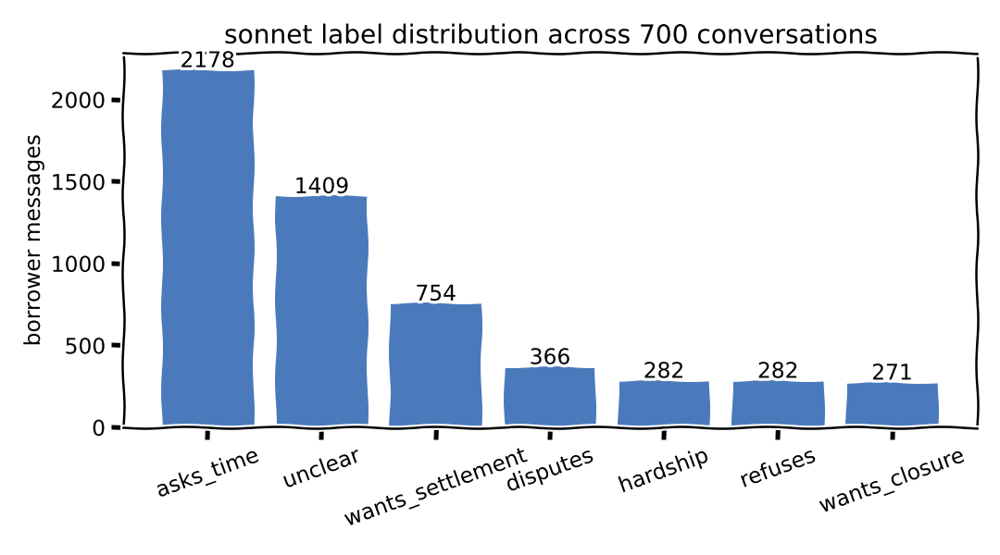
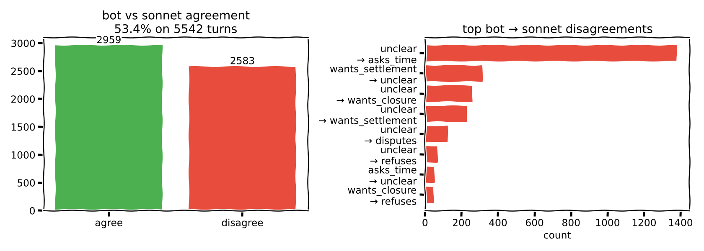
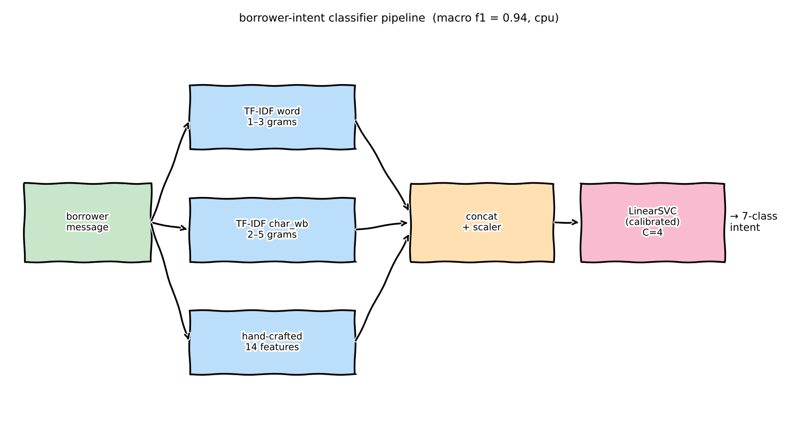
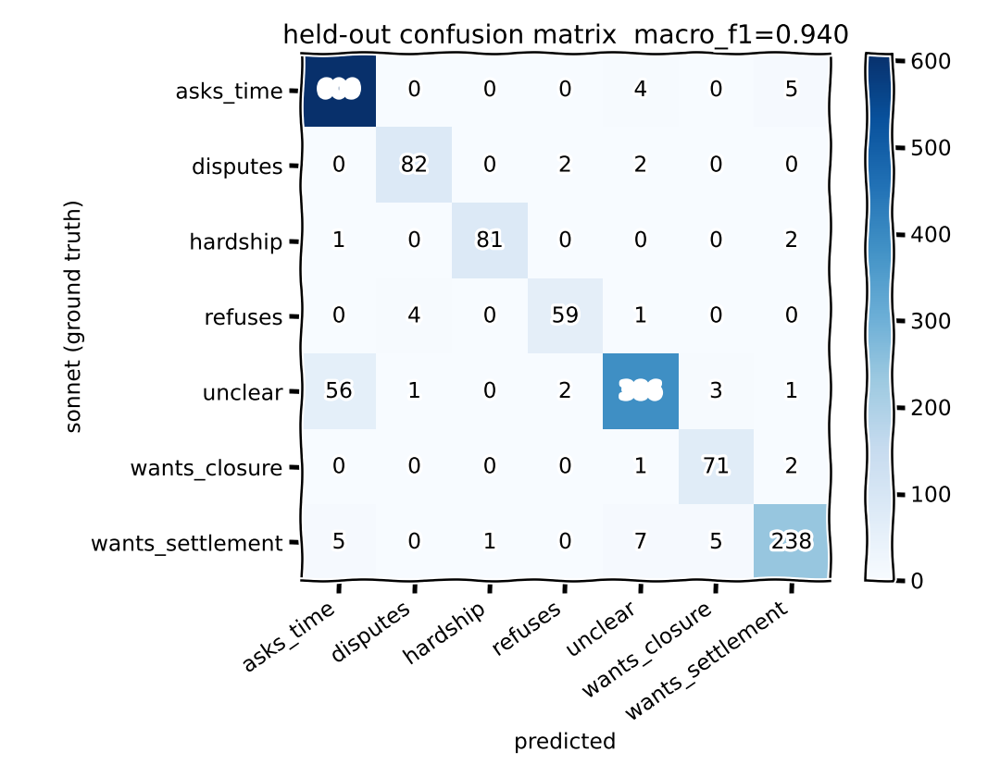
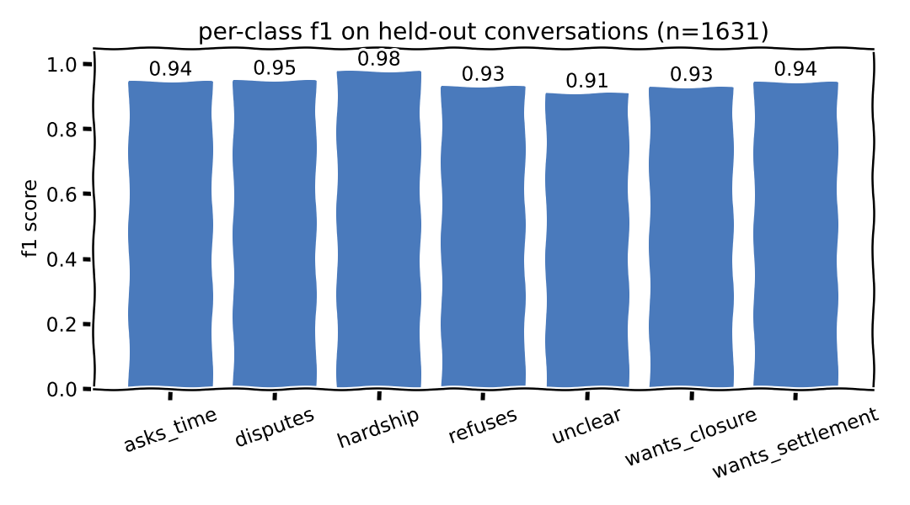
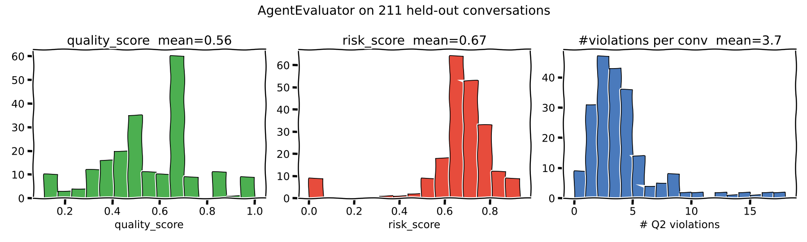

# Borrower-Intent Classifier — Session Writeup

End-to-end story of this session: from an un-graded `eval_takehome.py` to a
working, leakage-free, CPU-only borrower-intent classifier wired into the
evaluator.

## 1. Problem framing

The Riverline agent labels each borrower message into one of 7 intents
(`unclear`, `wants_settlement`, `wants_closure`, `refuses`, `disputes`,
`hardship`, `asks_time`). Spec §I5 and Q2 both hinge on these labels being
correct — a missed `hardship` or `refuses` is a compliance risk.

We had no ground truth. Step one was to manufacture some.

## 2. Ground truth via Sonnet 4.6

`scripts/annotate_borrower_intents.py`

- For each conversation we send Sonnet **only** the raw messages + metadata —
  never the bot's own classifications or state transitions, to avoid bias.
- The spec, README, and domain brief are attached as system prompt blocks with
  `cache_control=ephemeral`, so the ~9.8k-token reference prompt is written to
  cache once and reused at 10× cheaper (`$0.30/MTok` vs `$3/MTok`).
- Concurrency: `ThreadPoolExecutor(max_workers=parallel)` — caching is
  unaffected by parallelism; only wall-clock changes.
- Per-request usage (`input / output / cache_write_5m / cache_read`) is logged
  and priced at Sonnet 4.6 rates to print a total cost.

**Full run:** 700 conversations, parallel=20, **6m 19s**, **$12.09**
(≈$0.017/conv). Cache writes = 0 (kept warm across requests), 6.9M cache-read
tokens.



## 3. Bot vs. Sonnet — the headline finding



- **53.4%** agreement across 5,542 borrower turns.
- The dominant failure mode: `bot:unclear → sonnet:asks_time` (1,380 cases,
  53% of all disagreements). The bot's classifier under-commits.
- `unclear → wants_closure/wants_settlement/disputes/refuses/hardship`
  accounts for another ~700 disagreements. The bot is leaving intent signal
  on the table across every category.

## 4. A CPU-only classical classifier

`scripts/train_classifier.py` — treat Sonnet labels as ground truth and train
a classical baseline.

### Pipeline



- **Features**: TF-IDF word (1-3) + TF-IDF char_wb (2-5) + 14 hand-crafted
  features (length, digits, emoji count, and lexicon hits for
  time / refuse / dispute / hardship / settle / closure words in both English
  and Hindi/Hinglish).
- **Classifier**: LinearSVC wrapped in `CalibratedClassifierCV` (so we get
  probability outputs), `class_weight="balanced"`, tuned C via 5-fold stratified
  CV on the training set.

### Splitting strategy

Earlier iterations split at the message level, which leaks: multiple borrower
turns from the same conversation can end up on both sides. The final split is
**at the conversation level**: 489 training convs / 211 held-out convs
(seed=42, test_size=0.30). Conversation IDs are frozen to
`scripts/eval_split.json` so all downstream evaluation work hits the same
held-out set.

### Results

| stage | macro F1 | notes |
|---|---|---|
| baseline LR, balanced dataset, message-level split | 0.934 | first pass |
| tuned LR + hand features, balanced, message-level | 0.926 | |
| tuned SVM, balanced, message-level | 0.931 | |
| **tuned SVM, full imbalanced, message-level** | **0.948** | |
| tuned SVM, full, **conversation-level split (final)** | **0.940** | no leakage |




Every class lands at F1 ≥ 0.91. The remaining confusion is almost entirely the
`asks_time` ↔ `unclear` boundary — genuinely borderline messages like
"Maybe. I need to think."

## 5. Integration into `AgentEvaluator`

`eval_takehome.py` is self-contained:

- Declares `HandFeatures` locally (same regexes as the training script) and
  registers it into `sys.modules["__main__"]` before unpickling, so the pickled
  pipeline resolves cleanly.
- `__init__` loads `scripts/classifier_model.pkl` from disk — no external API
  calls inside `evaluate()`.
- `evaluate()` runs the classifier on every borrower message and compares the
  prediction against the bot's `bot_classifications`. Each disagreement
  becomes a `Q2_accurate_classification` violation. Severity is the
  classifier's confidence (floored at 0.3, raised to ≥0.8 when the classifier
  flips an `unclear` into a high-risk category — `hardship`, `refuses`,
  `disputes` — because missing those is a compliance concern per spec §6).
- `quality_score = 1 − disagreement_rate`;
  `risk_score = 0.5 × disagreement_rate + 0.5 × mean_severity`.
- `main()` detects `scripts/eval_split.json` and only evaluates held-out
  conversations.

### Held-out run on 211 conversations



- avg quality 0.556, avg risk 0.669, **775 Q2 violations** total
  (~3.7/conversation) — matches the 47% bot–Sonnet disagreement rate measured
  independently.

## 6. Files produced this session

```
scripts/
├── annotate_borrower_intents.py   # Sonnet annotator (parallel, cached, cost-logged)
├── annotations_full.json          # Sonnet labels for all 700 convs
├── train_classifier.py            # TF-IDF + SVM, conversation-level split
├── classifier_model.pkl           # pickled pipeline (loaded by evaluator)
├── classifier_report.txt          # test-set classification report
├── eval_split.json                # frozen train/eval conversation IDs
└── make_plots.py                  # regenerates everything in docs/plots/
eval_takehome.py                   # AgentEvaluator loads the pickle
docs/plots/*.png                   # xkcd-styled figures
```

## 7. What's next

- The classifier itself gives us a second opinion for every borrower turn and
  will underpin the state-transition and compliance checks (I1–I5, §6) in
  future iterations — e.g. bot stays in `intent_asked` after a clear
  `hardship` message is an escalation failure.
- Next target: amount validation (§7) and quiet-hours/DNC compliance (§5,
  §6.3). Both are deterministic from the logs — no model needed.
- The held-out 211-conv split is now the canonical eval set; none of those
  convs have been seen by the classifier during training, so we can track
  improvements honestly from here on.
