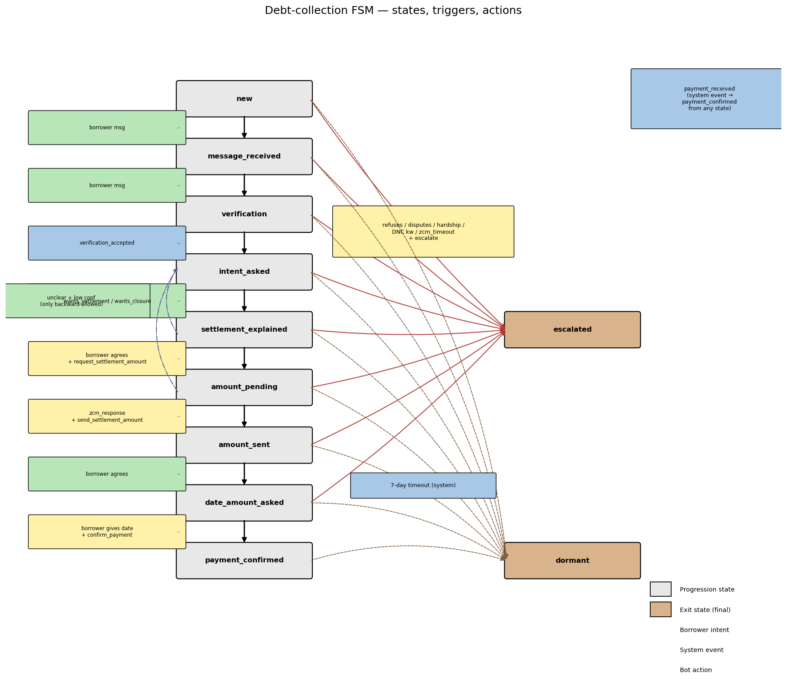
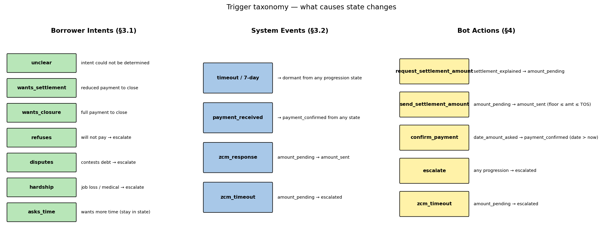
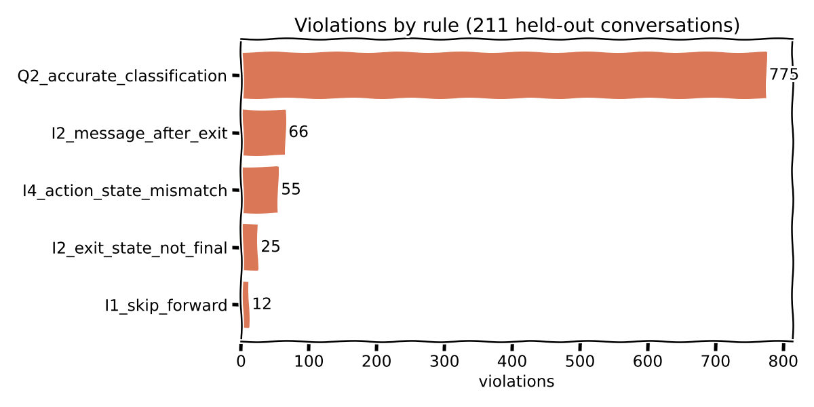
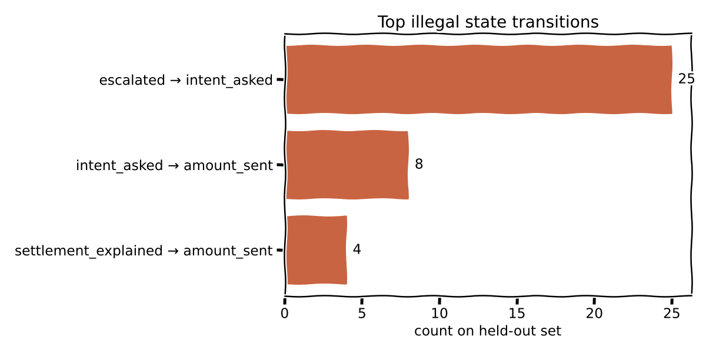
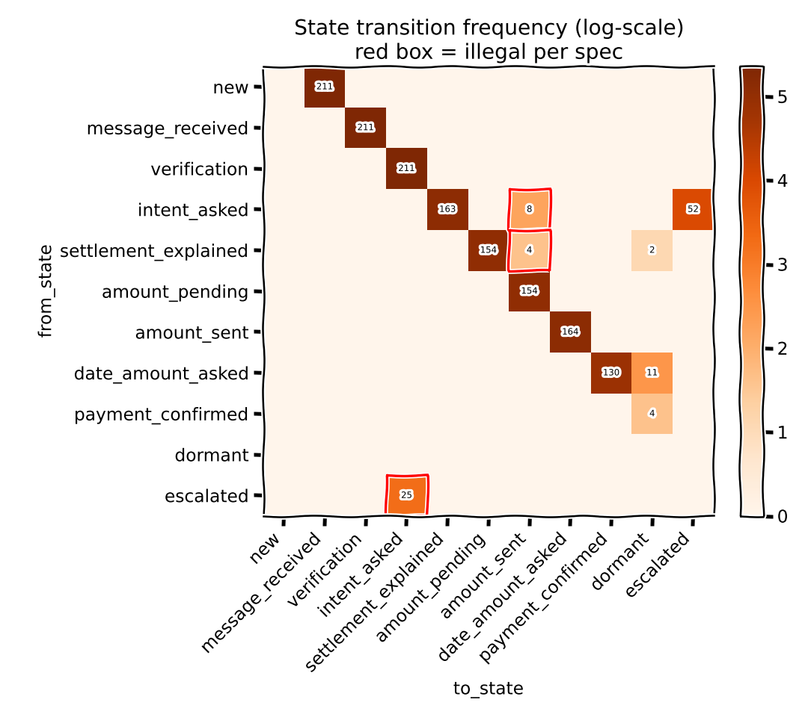
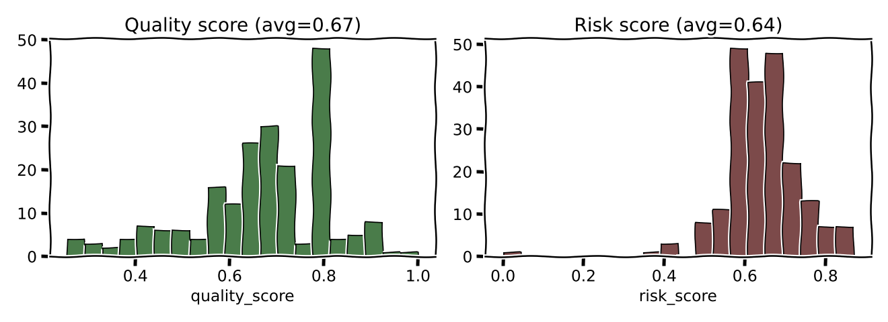

# FSM-Validity Evaluator — Session Writeup

Adds a deterministic state-machine layer to `eval_takehome.py` on top of the
existing Q2 classifier check. Covers invariants **I1–I5** from spec §6. No
LLM calls at evaluation time — the entire pipeline is a single `python
eval_takehome.py` invocation that runs on the 211-conv held-out split.

## 1. Framing: validity vs. correctness

Two questions sound similar but aren't:

- **Validity** — is the edge `(from_state → to_state)` allowed by the spec's
  transition matrix (§3, Table 1)? Pure graph check, deterministic.
- **Correctness** — did the bot's message actually *do* the thing the new
  state label implies? E.g. in conv #8 turn 5 the bot moved
  `intent_asked → settlement_explained` after the borrower said "What are
  my options?" — a valid edge, but the bot never actually explained
  settlement. That's a correctness/quality issue, not a validity one.

This pass implements validity only. Correctness is orthogonal and belongs in
an LLM-judged layer later.

## 2. The FSM at a glance



Nine progression states (grey) run top-to-bottom; two exit states (tan) sit
on the right and are absorbing. Every edge is annotated with what causes
it — colour-coded by kind:

- **Green** — borrower intent classification (`wants_settlement`,
  `unclear`, etc.)
- **Blue** — system event fired externally (`zcm_response`, `timeout`,
  `payment_received`)
- **Yellow** — bot action that must accompany the transition
  (`send_settlement_amount`, `confirm_payment`, `escalate`)

The **red fan** into `escalated` is the §6.1 rule: any progression state can
escalate on `refuses` / `disputes` / `hardship`, on a DNC keyword, on
`zcm_timeout` from `amount_pending`, or on the bot calling `escalate`
directly. The dashed brown fan into `dormant` is the 7-day inactivity
timeout, also available from every progression state. The purple
dash-dotted arrows are the *only* allowed backward transitions — from
`settlement_explained` or `amount_pending` back to `intent_asked`, and
only when the borrower's message was classified `unclear` with
confidence `low`. The floating blue chip on the top-right is
`payment_received`, which can short-circuit any state to
`payment_confirmed`.

### Trigger taxonomy



Three disjoint vocabularies feed into the state machine:

- **Borrower intents** — exactly one of seven labels per borrower message
  (§3.1). `unclear`, `asks_time` generally keep the conversation in its
  current state; the others drive forward progression or escalation.
- **System events** — fired by the runtime, not the borrower or the bot
  (§3.2). Note the ambiguity: `zcm_timeout` is documented in both §3.2
  (event) and §5 (action). The evaluator treats it as an event whose
  required landing edge is `amount_pending → escalated`.
- **Bot actions** — side-effects the bot performs during a transition
  (§4). These are what the evaluator's I4 check validates against
  `function_calls`: the action must match its required edge or it's a
  spec violation.

Two rules are worth highlighting because they're not visible in any single
edge:

1. **Self-transitions are always valid** for progression states. If the
   borrower sends something `unclear` during `verification`, the agent
   stays put and re-asks. The evaluator skips `from==to` entirely.
2. **Exit states are absorbing.** Once in `escalated` or `dormant`, no
   outbound messages are permitted and no transitions back exist. This is
   invariant I2.

## 3. Data shape

Every conversation in `data/production_logs.jsonl` carries:

| field | what's in it |
|---|---|
| `messages[]` | `{turn, role∈{bot,borrower}, text, timestamp}` |
| `bot_classifications[]` | `{turn, classification, confidence}` |
| `state_transitions[]` | `{turn, from_state, to_state, reason}` — multiple per turn allowed |
| `function_calls[]` | `{turn, function, params}` |
| `metadata` | `{language, zone, dpd, pos, tos, settlement_offered, total_turns}` |

The spec's matrix is expressed in `(from, to)` pairs, so the evaluator keys
off the edge — not the free-text `reason`, which mixes bot actions,
borrower-intent triggers, and system events across 14 distinct values.

## 4. What's checked

| rule | description | severity |
|---|---|---|
| **I1** | Transition not in Table 1's matrix (skip-forward, backward, or anything exotic) | 0.8–0.9 |
| **I1 backward exception** | `settlement_explained`/`amount_pending → intent_asked` only valid if the borrower turn is classifier-predicted `unclear` **and** bot confidence is `low` | 0.9 |
| **I2 exit not final** | Any transition whose `from_state ∈ {escalated, dormant}` | 1.0 |
| **I2 message after exit** | Any bot message at a turn strictly after the conversation first entered an exit state | 1.0 |
| **I3 chain discontinuity** | `transitions[i].from_state ≠ transitions[i-1].to_state`, or the chain doesn't start at `new` | 0.9 |
| **I4 action/state mismatch** | `function_calls` fired outside its required edge (e.g. `send_settlement_amount` without `amount_pending→amount_sent`, or `escalate` without landing in `escalated`) | 0.9 |
| **I5 missing classification** | Borrower message with no entry in `bot_classifications` | 0.5 |
| **Q2** (kept) | Classifier disagrees with bot's stored label | 0.3–1.0 |

Self-transitions (staying in the current state) are always valid per spec
§3.2 and skipped by the checker.

### Ambiguities resolved

- **`zcm_timeout`** appears in both §3.2 (system events) and §5 (actions) of
  the spec. The evaluator treats it as a system event whose valid landing
  edge is `amount_pending → escalated`; anything else trips I4.
- **Misclassified intent × transition validity** are kept orthogonal. Q2
  handles the label disagreement; I1 is evaluated against the graph edge
  alone. No double-counting.

## 5. Results on the 211-conv held-out split

```
avg quality_score: 0.667
avg risk_score:    0.643
total violations:  933
per-rule totals:   {'Q2': 775, 'I2': 91, 'I4': 55, 'I1': 12}
```



Q2 classification disagreement dominates (matches the 47% bot-vs-Sonnet
disagreement rate measured independently in [approach.md](./approach.md)).
On top of that, the spec-level violations cluster in I2 (exit-state leaks)
and I4 (actions fired outside their allowed edges).

### Top illegal edges on the held-out set



`escalated → intent_asked` is the single largest violation class — the bot
treats escalation as reversible and returns to intent-asking after a ZCM
timeout "re-engagement". Per spec §6 I2 this is a hard invariant violation,
because any bot message after escalation is a compliance risk regardless of
the downstream state.

### Full transition heatmap



Red-bordered cells are edges that appear in the data but are not in Table 1.
The pattern is clear: (a) exits are not absorbing in practice, (b) a
minority of happy-path runs skip `amount_pending` entirely and jump
`settlement_explained → amount_sent` or even `intent_asked → amount_sent`.

### Per-conversation scores



`quality_score = max(0, 1 − Σseverity / total_turns)` penalises dense
violations per turn. The bimodal shape reflects two populations: clean
happy-path conversations (high quality, Q2-only penalties) and conversations
that hit an I2/I4 invariant break (sharp drop into the 0.2–0.5 range).

## 6. Manual verification on 5 conversations

One conversation per violation archetype; every flag confirmed spec-correct:

| case | id | expected | flagged |
|---|---|---|---|
| happy path | `192f029c…` | no I-viols | ✓ Q2 only |
| escalated return | `f7c73e05…` | `escalated → intent_asked` + post-exit messages + `zcm_timeout` outside allowed edge | ✓ I2×2 + I4 |
| skip forward | `5280cd5c…` | `settlement_explained → amount_sent` skips `amount_pending`; `send_settlement_amount` needs that exact edge | ✓ I1_skip_forward + I4 |
| dormant after success | `51924834…` | `payment_confirmed → dormant` is allowed (progression→dormant always valid) | ✓ no I-viols |
| escalated self-loop | `63f0a960…` | bot keeps messaging after exit; `zcm_timeout` mismatched | ✓ I2 + I4 |

### Known nuance

Self-transitions on exit states (`escalated → escalated`) are not directly
flagged as I2, because the checker skips `from==to` universally (spec says
self-transitions are always valid for progression states; it's silent on
exit-state self-loops). The real compliance harm — the bot sending messages
after exit — is still caught by I2_message_after_exit, so there's no
practical gap.

## 7. Files

```
eval_takehome.py                         # AgentEvaluator + I1–I5 + Q2 checks
scripts/make_fsm_plots.py                # regenerates the violation plots
scripts/make_fsm_diagram.py              # regenerates the FSM diagram + trigger taxonomy
docs/plots/
├── fsm_diagram.png
├── fsm_triggers.png
├── fsm_violations_by_rule.png
├── fsm_illegal_edges.png
├── fsm_transition_heatmap.png
└── fsm_quality_risk.png
```

## 8. What's next

- **Amount validation (§7):** POS ≤ TOS, floor ≤ amount ≤ TOS, consistency
  of the quoted settlement amount across turns. All deterministic from
  `function_calls[*].params` + `metadata`.
- **Quiet hours + follow-up spacing (§5.1–5.2):** timestamp-only check in
  IST; no model needed.
- **Compliance keywords (§6.1–6.5):** DNC phrases, legal threats, language
  mismatch. Mostly regex + the borrower-language field from `metadata`.
- **Correctness layer:** the "did the bot actually explain settlement
  before moving to `settlement_explained`" question. This is the natural
  place for an LLM judge, scoped to the handful of edges where the state
  label makes a semantic claim about the bot's own message.
